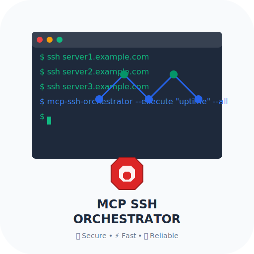

# mcp-ssh-orchestrator

<div align="center">
  
  <h3>A secure SSH fleet orchestrator built as a Model Context Protocol (MCP) server</h3>
  <p>Execute commands across your server fleet with policy-based access control, network filtering, and comprehensive audit logging.</p>
</div>

[](LICENSE)
[](https://modelcontextprotocol.io)
[](https://python.org)

## Features

- **Policy-Based Access Control**: Fine-grained command allow/deny rules with glob pattern matching
- **Network Security**: IP allowlists/blocklists with CIDR support and DNS resolution verification
- **Credential Management**: Support for SSH keys and passwords via Docker secrets or environment variables
- **Fleet Management**: Tag-based host grouping for bulk operations
- **Real-Time Streaming**: Live command output with progress tracking
- **Cancellation Support**: Cancel long-running commands mid-execution
- **Audit Logging**: JSON audit trail to stderr for all operations
- **Docker-Ready**: Runs in containers with non-root user and health checks

## Quick Start

### Using Docker (Recommended)

```bash
# Pull the image
docker pull ghcr.io/samerfarida/mcp-ssh-orchestrator:0.1.0

# Run interactively
docker run -i --rm \
  -v ~/mcp-ssh/config:/app/config:ro \
  -v ~/mcp-ssh/keys:/app/keys:ro \
  ghcr.io/samerfarida/mcp-ssh-orchestrator:0.1.0
```

### Using Docker Compose

```bash
# Clone the repository
git clone https://github.com/samerfarida/mcp-ssh-orchestrator
cd mcp-ssh-orchestrator

# Set up your configuration
cp examples/example-servers.yml config/servers.yml
cp examples/example-credentials.yml config/credentials.yml
cp examples/example-policy.yml config/policy.yml

# Edit config files with your hosts and credentials
# Place SSH keys in keys/ directory

# Run with compose
cd compose
docker-compose up
```

### Local Development

```bash
# Clone the repository
git clone https://github.com/samerfarida/mcp-ssh-orchestrator
cd mcp-ssh-orchestrator

# Create virtual environment
python3 -m venv .venv
source .venv/bin/activate

# Install in editable mode
pip install -e .

# Run the MCP server
python -m mcp_ssh.mcp_server stdio
```

## Configuration

### Directory Structure

```
mcp-ssh-orchestrator/
├── config/
│   ├── servers.yml       # Host inventory
│   ├── credentials.yml   # SSH credentials
│   └── policy.yml        # Security policies
├── keys/                 # SSH private keys (chmod 0400)
└── secrets/              # Docker secrets (passwords, passphrases)
```

### servers.yml

Define your SSH hosts:

```yaml
hosts:
  - alias: "web1"
    host: "10.0.0.11"
    port: 22
    credentials: "prod_admin"
    tags: ["web", "prod", "linux"]

  - alias: "db1"
    host: "10.0.0.21"
    port: 22
    credentials: "prod_admin"
    tags: ["db", "prod", "linux"]
```

### credentials.yml

Configure SSH authentication:

```yaml
entries:
  - name: "prod_admin"
    username: "ubuntu"
    key_path: "id_ed25519"              # Relative to /app/keys
    key_passphrase_secret: ""            # Optional passphrase
    password_secret: ""                  # For password auth

  - name: "password_auth"
    username: "admin"
    key_path: ""
    password_secret: "admin_password"    # Resolved from secret
```

**Secrets Resolution:**
1. Environment variable: `MCP_SSH_SECRET_<NAME>` (uppercase)
2. Docker secret file: `/app/secrets/<name>`

### policy.yml

Define security rules:

```yaml
# Global limits
limits:
  max_seconds: 60
  max_output_bytes: 1048576
  require_known_host: true

# Network controls
network:
  allow_cidrs: ["10.0.0.0/8"]
  block_ips: []

# Command rules
rules:
  - action: "allow"
    aliases: ["*"]
    tags: []
    commands:
      - "uname*"
      - "uptime*"
      - "df -h*"

  - action: "deny"
    aliases: ["*"]
    tags: []
    commands:
      - "rm -rf*"
      - "shutdown*"
```

## MCP Tools

### ssh_ping

Health check.

```json
{
  "name": "ssh_ping",
  "arguments": {}
}
```

### ssh_list_hosts

List all configured hosts.

```json
{
  "name": "ssh_list_hosts",
  "arguments": {}
}
```

Returns:
```json
["web1", "db1", "app1"]
```

### ssh_describe_host

Get host details.

```json
{
  "name": "ssh_describe_host",
  "arguments": {
    "alias": "web1"
  }
}
```

### ssh_plan

Dry-run a command (shows policy decision without executing).

```json
{
  "name": "ssh_plan",
  "arguments": {
    "alias": "web1",
    "command": "uptime"
  }
}
```

### ssh_run

Execute a command on a host.

```json
{
  "name": "ssh_run",
  "arguments": {
    "alias": "web1",
    "command": "uptime"
  }
}
```

Returns:
```json
{
  "task_id": "web1:a1b2c3d4:1234567890",
  "alias": "web1",
  "exit_code": 0,
  "duration_ms": 123,
  "cancelled": false,
  "timeout": false,
  "target_ip": "10.0.0.11",
  "output": "up 42 days, 3:14"
}
```

### ssh_run_on_tag

Execute a command on all hosts with a tag.

```json
{
  "name": "ssh_run_on_tag",
  "arguments": {
    "tag": "prod",
    "command": "uptime"
  }
}
```

### ssh_cancel

Cancel a running command.

```json
{
  "name": "ssh_cancel",
  "arguments": {
    "task_id": "web1:a1b2c3d4:1234567890"
  }
}
```

### ssh_reload_config

Reload configuration files without restarting.

```json
{
  "name": "ssh_reload_config",
  "arguments": {}
}
```

## Docker Desktop Integration

### Quick Setup

1. **Create configuration directory:**
   ```bash
   mkdir -p ~/mcp-ssh/{config,keys,secrets}
   ```

2. **Copy example configurations:**
   ```bash
   cp examples/example-servers.yml ~/mcp-ssh/config/servers.yml
   cp examples/example-credentials.yml ~/mcp-ssh/config/credentials.yml
   cp examples/example-policy.yml ~/mcp-ssh/config/policy.yml
   ```

3. **Add your SSH keys:**
   ```bash
   cp ~/.ssh/id_ed25519 ~/mcp-ssh/keys/
   chmod 0400 ~/mcp-ssh/keys/id_ed25519
   ```

4. **Configure Claude Desktop** (`~/Library/Application Support/Claude/claude_desktop_config.json` on macOS):

```json
{
  "mcpServers": {
    "ssh-orchestrator": {
      "command": "docker",
      "args": [
        "run",
        "-i",
        "--rm",
        "-v", "/Users/YOUR_USERNAME/mcp-ssh/config:/app/config:ro",
        "-v", "/Users/YOUR_USERNAME/mcp-ssh/keys:/app/keys:ro",
        "-v", "/Users/YOUR_USERNAME/mcp-ssh/secrets:/app/secrets:ro",
        "ghcr.io/samerfarida/mcp-ssh-orchestrator:0.1.0"
      ]
    }
  }
}
```

**Replace `YOUR_USERNAME` with your actual username!**

### Docker Desktop GUI Configuration

For users who prefer the Docker Desktop GUI:

1. **Open Docker Desktop** and go to **Settings** → **Resources** → **File Sharing**
2. **Add your configuration directory** to the shared folders list
3. **Use the GUI to configure MCP servers** in Claude Desktop settings

### Environment Variables for Secrets

Instead of files, you can use environment variables:

```json
{
  "mcpServers": {
    "ssh-orchestrator": {
      "command": "docker",
      "args": [
        "run",
        "-i",
        "--rm",
        "-e", "MCP_SSH_SECRET_STAGING_PASSWORD=your-password",
        "-v", "/Users/YOUR_USERNAME/mcp-ssh/config:/app/config:ro",
        "-v", "/Users/YOUR_USERNAME/mcp-ssh/keys:/app/keys:ro",
        "ghcr.io/samerfarida/mcp-ssh-orchestrator:0.1.0"
      ]
    }
  }
}
```

### Complete Setup Guide

For detailed setup instructions, see [DOCKER_DESKTOP.md](docs/DOCKER_DESKTOP.md).

## Security Best Practices

1. **SSH Keys**: Use key-based authentication instead of passwords
2. **File Permissions**: Set private keys to `chmod 0400`
3. **Known Hosts**: Enable `require_known_host: true` in production
4. **Network Filtering**: Use `allow_cidrs` to restrict target IPs
5. **Command Policies**: Start with deny-by-default and allow specific patterns
6. **Read-Only Mounts**: Mount config and keys as read-only (`:ro`)
7. **Secrets**: Never commit secrets to Git; use Docker secrets or env vars
8. **Audit Logs**: Monitor stderr output for security events

## Development

### Running Tests

```bash
# Install dev dependencies
pip install -e ".[dev]"

# Run tests
pytest

# Run with coverage
pytest --cov=mcp_ssh --cov-report=html
```

### Linting

```bash
# Format code
black src/ tests/

# Lint
ruff check src/ tests/

# Type check
mypy src/
```

### Building Docker Image

```bash
docker build -t mcp-ssh-orchestrator:local .
```

## Contributing

See [CONTRIBUTING.md](docs/CONTRIBUTING.md) for development setup and contribution guidelines.

## License

Apache 2.0 - See [LICENSE](LICENSE) for details.

## Links

- [MCP Specification](https://modelcontextprotocol.io)
- [Docker MCP Registry](https://github.com/docker/mcp-registry)
- [GitHub Repository](https://github.com/samerfarida/mcp-ssh-orchestrator)
- [Issue Tracker](https://github.com/samerfarida/mcp-ssh-orchestrator/issues)
