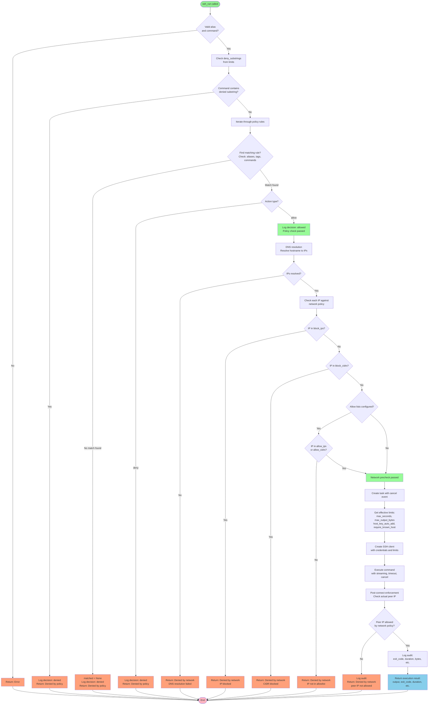
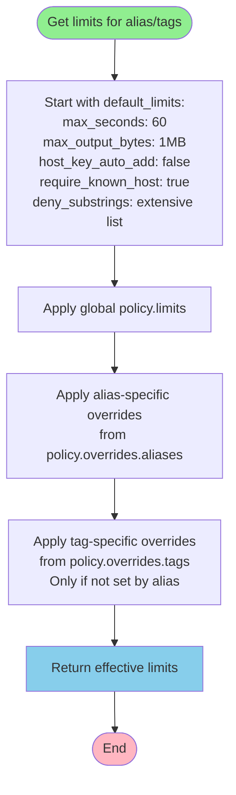
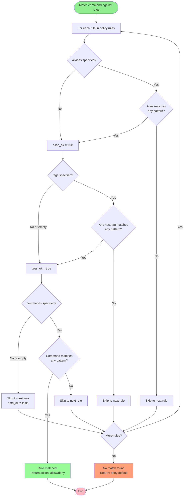
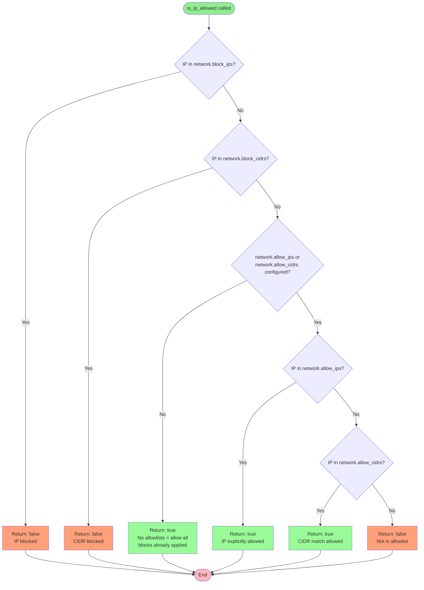

# Policy Engine Flowchart

This flowchart visualizes the policy engine logic in mcp-ssh-orchestrator.

## Command Execution Flow

## Limits Resolution Flow

## Rule Matching Logic

## IP Network Policy Check

## Key Principles

1. **Deny by default**: Commands must match an "allow" rule to execute
2. **Defense in depth**: Multiple layers of checks (deny_substrings → rules → network)
3. **Fail closed**: Any error in validation results in denial
4. **Pre and post checks**: Network policy enforced before and after connection
5. **Hierarchical limits**: Default → Global → Alias → Tags (with precedence rules)
6. **Audit logging**: All decisions and executions are logged with timestamps and hashes

