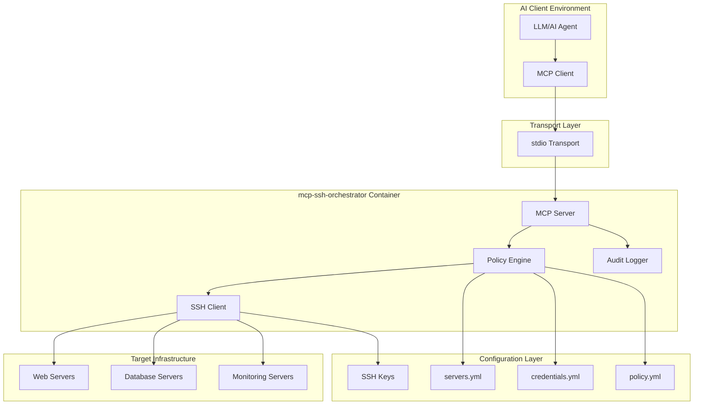
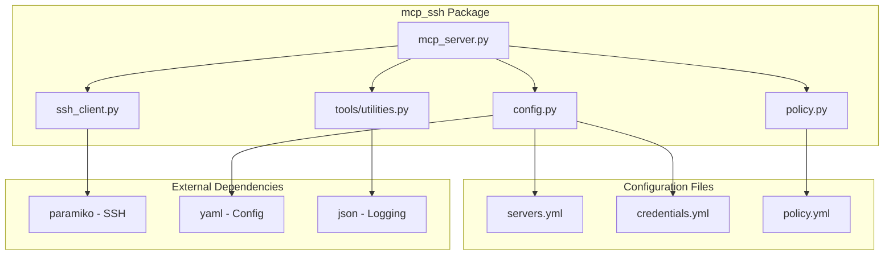
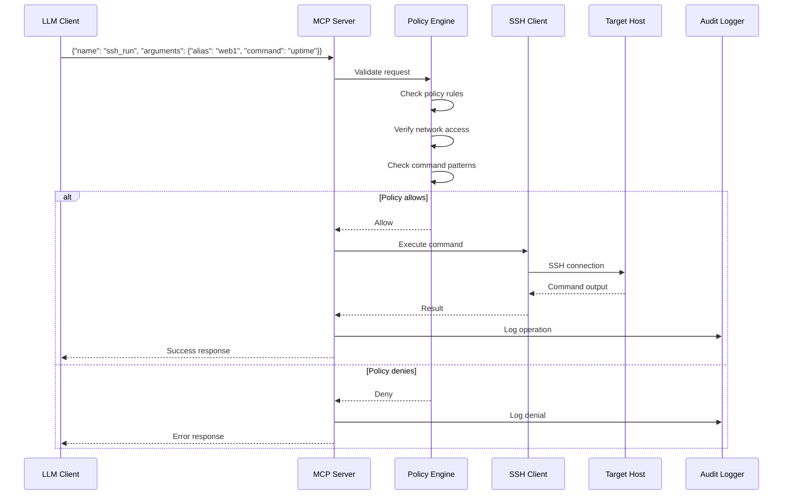
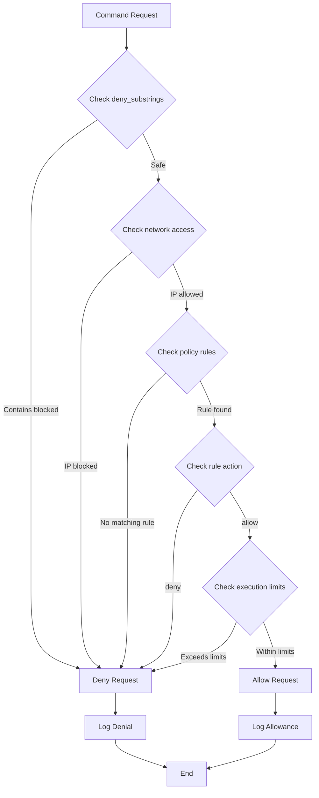
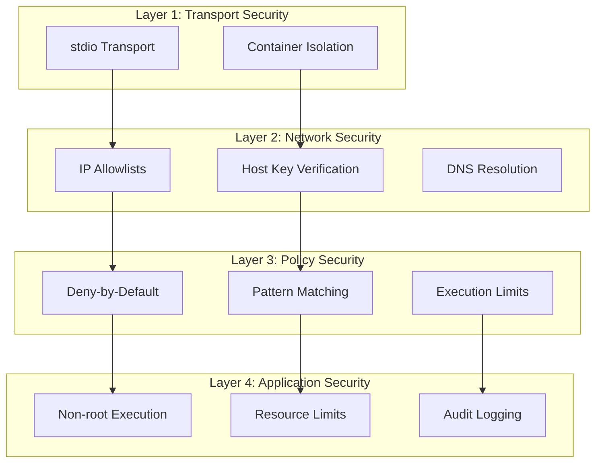
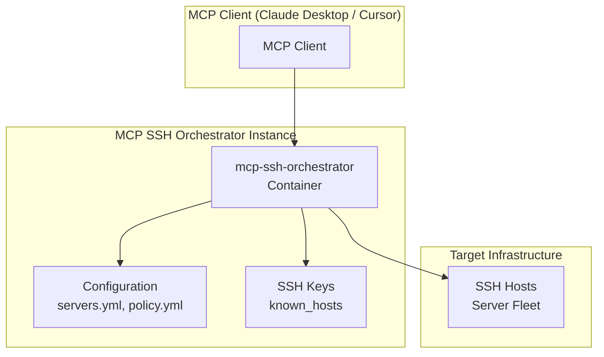
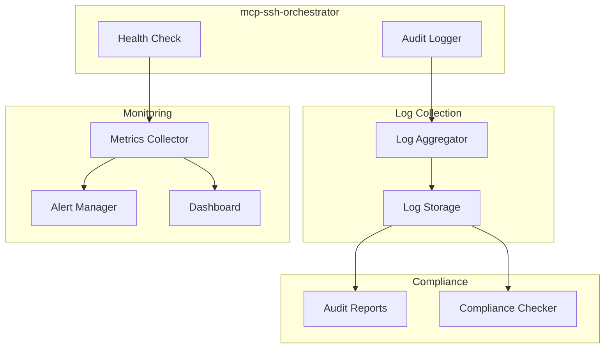
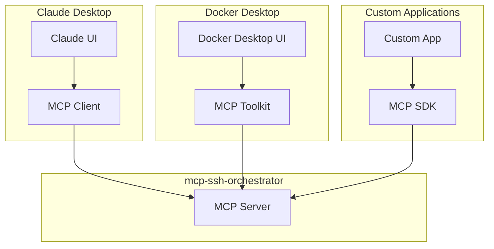
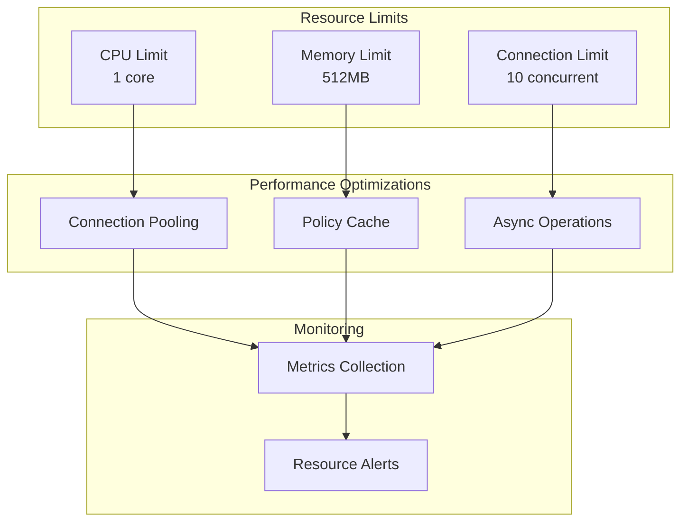

# 4. Architecture

**Purpose:** Explain the system design, component relationships, and data flow of mcp-ssh-orchestrator.

## System Overview

mcp-ssh-orchestrator is a **stateless, policy-driven SSH command executor** designed as a Model Context Protocol (MCP) server. It provides secure, auditable access to SSH infrastructure through a standardized interface.

## High-Level Architecture



## Component Architecture

### Core Components



## Data Flow Architecture

### Command Execution Flow



### Policy Evaluation Flow



## Component Details

### 1. MCP Server (`mcp_server.py`)

**Purpose:** Main entry point and MCP protocol implementation.

**Responsibilities:**

- Handle MCP protocol communication
- Route tool calls to appropriate handlers
- Manage request/response lifecycle
- Coordinate with other components

**Key Functions:**
```python
@mcp.tool()
def ssh_run(alias: str = "", command: str = "") -> str:
    """Execute a command on a host."""
    
@mcp.tool()
def ssh_plan(alias: str = "", command: str = "") -> str:
    """Dry-run a command (shows policy decision)."""
```

### 2. Configuration Manager (`config.py`)

**Purpose:** Load and validate configuration files.

**Responsibilities:**

- Parse YAML configuration files
- Validate configuration syntax
- Provide configuration to other components
- Handle configuration reloading

**Configuration Sources:**

- `servers.yml` - Host inventory
- `credentials.yml` - SSH authentication
- `policy.yml` - Security policies

### 3. Policy Engine (`policy.py`)

**Purpose:** Enforce security policies and access controls.

**Responsibilities:**

- Evaluate policy rules
- Check network access controls
- Validate command patterns
- Apply execution limits
- Generate policy decisions

**Policy Components:**

- **Rule Engine:** Pattern matching with glob support
- **Network Controls:** IP allowlists/blocklists
- **Execution Limits:** Timeouts, output size caps
- **Override System:** Per-host and per-tag customization

### 4. SSH Client (`ssh_client.py`)

**Purpose:** Execute SSH commands on target hosts.

**Responsibilities:**

- Establish SSH connections
- Execute commands remotely
- Handle SSH authentication
- Manage connection lifecycle
- Stream command output

**Security Features:**

- Host key verification
- Connection timeout management
- Output size limiting
- Graceful error handling

### 5. Audit Logger (`tools/utilities.py`)

**Purpose:** Generate comprehensive audit logs.

**Responsibilities:**

- Log all operations to stderr
- Generate structured JSON logs
- Include security-relevant metadata
- Support compliance requirements

**Log Format:**
```json
{
  "type": "audit",
  "ts": 1729512345.67,
  "alias": "prod-web-1",
  "hash": "a1b2c3d4e5f6",
  "exit_code": 0,
  "duration_ms": 123,
  "target_ip": "10.0.0.11"
}
```

## Deployment Architecture

### Container Architecture

```mermaid
graph TB
    subgraph "Docker Container"
        subgraph "Application Layer"
            MCP_SERVER[MCP Server Process]
        end
        
        subgraph "Configuration Layer"
            CONFIG_DIR[/app/config]
            KEYS_DIR[/app/keys]
            SECRETS_DIR[/app/secrets]
        end
        
        subgraph "System Layer"
            NON_ROOT[Non-root User<br/>UID 10001]
            RESOURCE_LIMITS[CPU/Memory Limits]
        end
    end
    
    subgraph "Host System"
        VOLUMES[Volume Mounts]
        NETWORK[Network Access]
    end
    
    VOLUMES --> CONFIG_DIR
    VOLUMES --> KEYS_DIR
    VOLUMES --> SECRETS_DIR
    
    NETWORK --> MCP_SERVER
```

### Multi-Environment Architecture

```mermaid
graph TB
    subgraph "Development Environment"
        DEV_CLIENT[Claude Desktop]
        DEV_CONTAINER[mcp-ssh-orchestrator]
        DEV_HOSTS[Dev Servers]
    end
    
    subgraph "Staging Environment"
        STG_CLIENT[Claude Desktop]
        STG_CONTAINER[mcp-ssh-orchestrator]
        STG_HOSTS[Staging Servers]
    end
    
    subgraph "Production Environment"
        PROD_CLIENT[Claude Desktop]
        PROD_CONTAINER[mcp-ssh-orchestrator]
        PROD_HOSTS[Production Servers]
    end
    
    DEV_CLIENT --> DEV_CONTAINER
    DEV_CONTAINER --> DEV_HOSTS
    
    STG_CLIENT --> STG_CONTAINER
    STG_CONTAINER --> STG_HOSTS
    
    PROD_CLIENT --> PROD_CONTAINER
    PROD_CONTAINER --> PROD_HOSTS
```



## Security Architecture

### Defense-in-Depth Layers



## Resource Management

### Current Architecture

MCP SSH Orchestrator is designed for single-container deployment per MCP client. Each client (Claude Desktop, Cursor, etc.) connects to its own orchestrator instance.



**Design Principles:**

- One container per MCP client
- Stateless design (no shared state between instances)
- Resource limits: 512MB memory, 1 CPU
- No load balancer required (scaling at client level)

## Monitoring Architecture

### Observability Stack



## Integration Architecture

### MCP Client Integration



## Performance Architecture

### Resource Management



## Next Steps

- **[Security Model](05-Security-Model)** - Detailed security architecture and controls
- **[Configuration](06-Configuration)** - Configuration system design and usage
- **[Deployment](09-Deployment)** - Production deployment architecture
- **[Observability & Audit](11-Observability-Audit)** - Monitoring and compliance architecture
