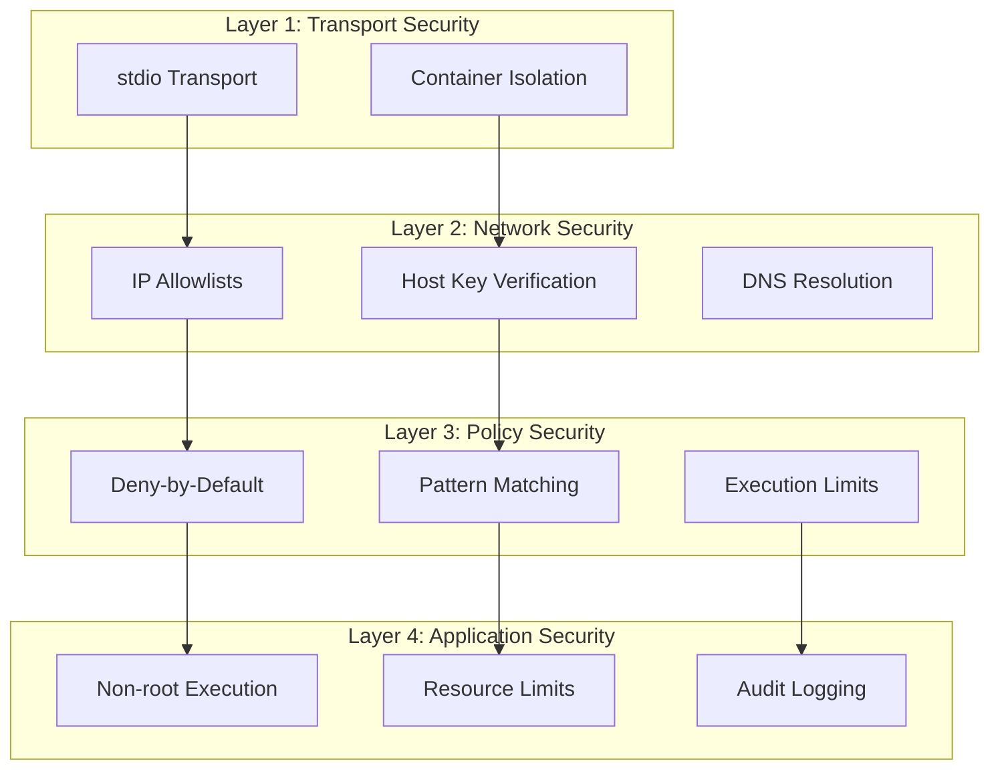

# 5. Security Model

**Purpose:** Explain the defense-in-depth security architecture that protects against MCP security risks and ensures safe SSH command execution.

## Security Philosophy

mcp-ssh-orchestrator implements a **defense-in-depth security model** inspired by [Docker's MCP security best practices](https://www.docker.com/blog/mcp-security-explained/). Every layer provides independent security controls, ensuring that a failure in one layer doesn't compromise the entire system.

## Defense-in-Depth Architecture



## Layer 1: Transport Security

### stdio Transport Security

**Purpose:** Secure communication between MCP client and server.

**Implementation:**
- **Process isolation** via stdio transport
- **No network exposure** of MCP server
- **Structured JSON-RPC** communication
- **Type-safe interfaces** for all tools

**Security Benefits:**
- No network attack surface
- Process-level isolation
- Structured data prevents injection
- Type validation ensures integrity

**Example:**
```json
{
  "jsonrpc": "2.0",
  "method": "tools/call",
  "params": {
    "name": "ssh_run",
    "arguments": {
      "alias": "web1",
      "command": "uptime"
    }
  },
  "id": 1
}
```

### Container Isolation

**Purpose:** Isolate the MCP server from the host system.

**Implementation:**
- **Non-root execution** (UID 10001)
- **Read-only filesystem** mounts
- **Resource limits** (CPU, memory)
- **Minimal base image** (python:3.13-slim)

**Security Benefits:**
- Prevents host privilege escalation
- Limits resource consumption
- Reduces attack surface
- Immutable runtime environment

**Example:**
```dockerfile
# Non-root user
RUN useradd -u 10001 -m appuser
USER appuser

# Read-only mounts
VOLUME ["/app/config:ro", "/app/keys:ro"]

# Resource limits
CMD ["python", "-m", "mcp_ssh.mcp_server", "stdio"]
```

## Layer 2: Network Security

### IP Allowlists

**Purpose:** Restrict SSH connections to authorized networks only.

**Implementation:**
- **CIDR-based allowlists** for network ranges
- **Specific IP allowlists** for individual hosts
- **IP blocklists** for dangerous addresses
- **DNS resolution verification** before connection

**Security Benefits:**
- Prevents connections to unauthorized hosts
- Blocks access to public internet
- Mitigates DNS poisoning attacks
- Enforces network segmentation

**Example:**
```yaml
network:
  # Allow only private networks
  allow_cidrs:
    - "10.0.0.0/8"
    - "192.168.0.0/16"
    - "172.16.0.0/12"
  
  # Block dangerous IPs
  block_ips:
    - "0.0.0.0"
    - "255.255.255.255"
    - "169.254.0.0/16"  # Link-local
```

### Host Key Verification

**Purpose:** Prevent man-in-the-middle attacks on SSH connections.

**Implementation:**
- **known_hosts verification** before connection
- **Host key fingerprinting** for identity verification
- **Strict host checking** in production
- **Auto-add option** for development only

**Security Benefits:**
- Prevents MITM attacks
- Ensures host identity verification
- Detects host key changes
- Maintains connection integrity

**Example:**
```yaml
limits:
  require_known_host: true  # Production default

network:
  require_known_host: true   # Override for strict checking
```

## Layer 3: Policy Security

### Deny-by-Default Model

**Purpose:** Ensure no unauthorized commands can execute.

**Implementation:**
- **Empty rules list** = deny all
- **Explicit allow rules** required for access
- **Rule precedence** with deny rules taking priority
- **Pattern matching** with glob support

**Security Benefits:**
- Prevents accidental access
- Requires explicit authorization
- Reduces attack surface
- Enables least-privilege access

**Example:**
```yaml
rules:
  # Explicit allow rules only
  - action: "allow"
    aliases: ["prod-*"]
    commands: ["uptime*", "df -h*"]
  
  # All other commands denied by default
```

### Pattern Matching Security

**Purpose:** Provide flexible yet secure command filtering.

**Implementation:**
- **Glob pattern matching** for commands
- **Substring blocking** for dangerous commands
- **Alias and tag matching** for host targeting
- **Case-sensitive matching** for precision

**Security Benefits:**
- Flexible command authorization
- Blocks dangerous command patterns
- Enables environment-specific policies
- Prevents command injection

**Example:**
```yaml
limits:
  deny_substrings:
    - "rm -rf /"
    - "shutdown*"
    - "reboot*"
    - "ssh "  # Prevent lateral movement

rules:
  - action: "allow"
    commands:
      - "systemctl status *"  # Safe status commands
      - "uptime*"            # System information
      - "df -h*"             # Disk usage
```

### Execution Limits

**Purpose:** Prevent resource exhaustion and runaway processes.

**Implementation:**
- **Command timeouts** (max_seconds)
- **Output size limits** (max_output_bytes)
- **Per-host overrides** for specific limits
- **Per-tag overrides** for environment limits

**Security Benefits:**
- Prevents resource exhaustion
- Limits data exfiltration
- Enables DoS protection
- Supports compliance requirements

**Example:**
```yaml
limits:
  max_seconds: 60
  max_output_bytes: 1048576

overrides:
  aliases:
    prod-db-1:
      max_seconds: 20           # Stricter for production DB
      max_output_bytes: 131072  # Smaller output limit
```

## Layer 4: Application Security

### Non-Root Execution

**Purpose:** Limit damage if the application is compromised.

**Implementation:**
- **UID 10001** for application user
- **No sudo privileges** or escalation
- **Limited filesystem access** via volumes
- **No system modification** capabilities

**Security Benefits:**
- Prevents privilege escalation
- Limits system access
- Reduces attack impact
- Enables container security

### Resource Limits

**Purpose:** Prevent resource exhaustion attacks.

**Implementation:**
- **CPU limits** via container constraints
- **Memory limits** via container constraints
- **File descriptor limits** via ulimits
- **Process limits** via container policies

**Security Benefits:**
- Prevents DoS attacks
- Ensures fair resource usage
- Enables monitoring
- Supports multi-tenancy

### Audit Logging

**Purpose:** Provide comprehensive audit trail for compliance and security.

**Implementation:**
- **JSON structured logs** to stderr
- **Complete operation trail** for all commands
- **Security-relevant metadata** in every log entry
- **Immutable log format** for integrity

**Security Benefits:**
- Enables incident response
- Supports compliance audits
- Provides forensic evidence
- Enables security monitoring

**Example:**
```json
{
  "type": "audit",
  "ts": 1729512345.67,
  "alias": "prod-web-1",
  "hash": "a1b2c3d4e5f6",
  "exit_code": 0,
  "duration_ms": 123,
  "bytes_out": 45,
  "bytes_err": 0,
  "cancelled": false,
  "timeout": false,
  "target_ip": "10.0.0.11",
  "policy_decision": "allow",
  "rule_matched": "prod-readonly"
}
```

## Security Controls Matrix

| **Threat** | **Layer 1** | **Layer 2** | **Layer 3** | **Layer 4** |
|------------|-------------|-------------|-------------|-------------|
| **Command Injection** | stdio isolation | Network filtering | Pattern matching | Resource limits |
| **Privilege Escalation** | Container isolation | Host verification | Policy enforcement | Non-root execution |
| **Data Exfiltration** | Process isolation | IP allowlists | Output limits | Audit logging |
| **Resource Exhaustion** | Container limits | Connection limits | Execution limits | Resource monitoring |
| **Lateral Movement** | Transport security | Network segmentation | Command blocking | Access logging |
| **MITM Attacks** | stdio transport | Host key verification | Policy validation | Audit trail |

## Policy Engine Security

### Rule Evaluation Security

**Purpose:** Ensure policy decisions are secure and auditable.

**Implementation:**
- **Deterministic evaluation** order
- **Rule precedence** with deny rules first
- **Pattern validation** before matching
- **Decision logging** for audit

**Security Benefits:**
- Predictable policy behavior
- Secure default decisions
- Auditable policy evaluation
- Prevents policy bypass

### Override System Security

**Purpose:** Allow granular control while maintaining security.

**Implementation:**
- **Per-host overrides** for specific limits
- **Per-tag overrides** for environment limits
- **Override precedence** (alias > tag > global)
- **Override validation** before application

**Security Benefits:**
- Granular security control
- Environment-specific policies
- Maintains security boundaries
- Enables compliance requirements

## Compliance & Standards

### SOC 2 / ISO 27001

**Controls Implemented:**
- **Access Control:** Policy-based command authorization
- **Audit Trail:** Complete JSON audit logs
- **Encryption:** SSH transport encryption
- **Secrets Management:** Docker secrets or environment variables

### PCI-DSS

**Controls Implemented:**
- **Logging:** All administrative access logged
- **Network Segmentation:** IP allowlists enforce boundaries
- **Strong Cryptography:** Ed25519/RSA keys, SSH protocol
- **Access Control:** Deny-by-default policy model

### HIPAA

**Controls Implemented:**
- **Access Controls:** Policy-based restrictions
- **Audit Logs:** Complete audit trail of PHI system access
- **Encryption:** SSH transport encryption
- **Access Management:** Role-based access via tags

## Security Monitoring

### Real-Time Monitoring

**Metrics Tracked:**
- **Policy violations** (denied commands)
- **Execution failures** (timeouts, errors)
- **Resource usage** (CPU, memory, connections)
- **Network access** (unauthorized IPs)

**Alerting:**
- **Repeated policy violations** from same source
- **Unexpected target IPs** in connections
- **Resource exhaustion** warnings
- **High-privilege commands** execution

### Incident Response

**Detection:**
- **Audit log analysis** for suspicious patterns
- **Policy violation correlation** across hosts
- **Resource usage anomalies** detection
- **Network access violations** monitoring

**Response:**
- **Immediate policy updates** for new threats
- **Host isolation** for compromised systems
- **Credential rotation** for exposed keys
- **Forensic analysis** using audit logs

## Security Best Practices

### Configuration Security

1. **Use deny-by-default policies**
2. **Enable host key verification**
3. **Configure IP allowlists**
4. **Set appropriate timeouts and limits**
5. **Use strong SSH keys (Ed25519/RSA 4096)**

### Operational Security

1. **Monitor audit logs continuously**
2. **Rotate SSH keys quarterly**
3. **Review policy rules monthly**
4. **Test policy changes with dry-run**
5. **Maintain incident response procedures**

### Development Security

1. **Containerize all deployments**
2. **Use non-root execution**
3. **Implement resource limits**
4. **Enable comprehensive logging**
5. **Follow secure coding practices**

## Next Steps

- **[Configuration](06-Configuration)** - How to implement these security controls
- **[Troubleshooting](12-Troubleshooting)** - Security incident response procedures
- **[Observability & Audit](11-Observability-Audit)** - Monitoring and compliance implementation
- **[Deployment](09-Deployment)** - Secure production deployment practices
