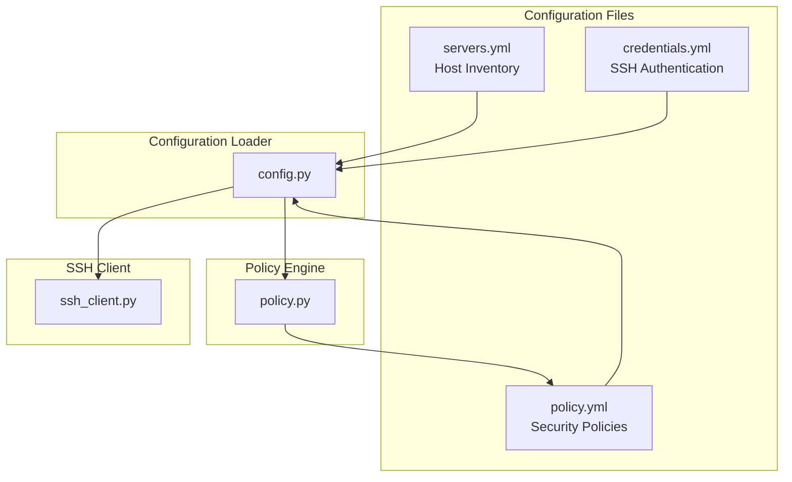

# 6. Configuration

**Purpose:** Overview of the configuration system and how the three main configuration files work together to define hosts, credentials, and security policies.

## Configuration Overview

mcp-ssh-orchestrator uses a **three-file configuration system** that separates concerns and enables secure, flexible deployment:

- **[servers.yml](06.1-servers.yml)** - Host inventory and network configuration
- **[credentials.yml](06.2-credentials.yml)** - SSH authentication and secrets management  
- **[policy.yml](06.3-policy.yml)** - Security policies and access controls

## Configuration Architecture



## Directory Structure

```
mcp-ssh-orchestrator/
├── config/
│   ├── servers.yml       # Host inventory
│   ├── credentials.yml   # SSH credentials
│   └── policy.yml        # Security policies
├── keys/                 # SSH private keys (chmod 0400)
└── secrets/              # Docker secrets (passwords, passphrases)
```

## Configuration Loading Process

### 1. File Discovery
The configuration loader searches for files in this order:
1. **Command-line arguments** (if specified)
2. **Environment variables** (`MCP_SSH_CONFIG_DIR`)
3. **Default paths** (`/app/config/` in container, `./config/` locally)

### 2. File Validation
Each configuration file is validated for:
- **YAML syntax** correctness
- **Required fields** presence
- **Data type** validation
- **Cross-file references** validity

### 3. Configuration Merging
The system merges configurations with this precedence:
1. **servers.yml** - Host definitions and network settings
2. **credentials.yml** - Authentication methods and secrets
3. **policy.yml** - Security policies and access controls

## Configuration Relationships

### servers.yml ↔ credentials.yml
**Relationship:** Hosts reference credential entries by name.

```yaml
# servers.yml
hosts:
  - alias: "web1"
    host: "10.0.0.11"
    credentials: "prod_admin"  # References credentials.yml

# credentials.yml  
entries:
  - name: "prod_admin"        # Referenced by servers.yml
    username: "ubuntu"
    key_path: "id_ed25519"
```

### servers.yml ↔ policy.yml
**Relationship:** Policy rules can target hosts by alias or tags.

```yaml
# servers.yml
hosts:
  - alias: "prod-web-1"
    tags: ["production", "web"]  # Used by policy rules

# policy.yml
rules:
  - action: "allow"
    aliases: ["prod-*"]        # Matches prod-web-1
    tags: ["production"]       # Matches production tag
    commands: ["uptime*"]
```

### credentials.yml ↔ policy.yml
**Relationship:** Policy can enforce credential requirements.

```yaml
# credentials.yml
entries:
  - name: "prod_admin"
    username: "ubuntu"
    key_path: "id_ed25519"

# policy.yml
limits:
  require_known_host: true     # Enforces host key verification
```

## Configuration Validation

### Syntax Validation
```bash
# Validate YAML syntax
python -c "import yaml; yaml.safe_load(open('config/servers.yml'))"
```

### Cross-Reference Validation
```bash
# Check credential references
python -c "
from mcp_ssh.config import Config
config = Config('config/')
print('Valid configuration:', config.validate())
"
```

### Policy Validation
```bash
# Test policy rules
python -c "
from mcp_ssh.policy import Policy
policy = Policy('config/policy.yml')
print('Policy valid:', policy.validate())
"
```

## Configuration Security

### Path Traversal Protection

**Security Enhancement:** mcp-ssh-orchestrator includes built-in path traversal protection for all file path resolution.

#### Secret Path Security

- Secret names are validated to contain only safe characters (alphanumeric, dash, underscore)
- Absolute paths are rejected for secrets (relative paths only)
- All paths are normalized and validated to stay within `/app/secrets`
- Path traversal attempts (e.g., `../`, `..\\`) are blocked and logged

#### SSH Key Path Security

- Key paths can be relative or absolute
- Absolute paths must be within the configured `keys_dir`
- Traversal patterns (`..`, `..\\`) are detected and rejected
- Paths are normalized and validated before access
- Only regular files are accepted (directories and symlinks are rejected)

#### File Type Validation

All resolved file paths are validated to ensure security:

- **Directories**: Rejected (paths must point to files, not directories)
- **Symbolic Links**: Rejected (symlinks can be security risks)
- **Regular Files**: Accepted (must exist for secrets, optional for keys)
- **Non-existent files**: Allowed for keys (validated when actually used)

**Security Events**: All path traversal attempts and file validation failures are logged as security events for monitoring and incident response.

### File Permissions
```bash
# Secure configuration files
chmod 0600 config/servers.yml
chmod 0600 config/credentials.yml  
chmod 0600 config/policy.yml
chmod 0400 keys/*.pem
chmod 0400 keys/id_ed25519
```

### Secrets Management
```yaml
# credentials.yml - Use secrets, not plaintext
entries:
  - name: "prod_admin"
    username: "ubuntu"
    key_path: "id_ed25519"
    key_passphrase_secret: "prod_key_passphrase"  # Docker secret
    password_secret: ""                            # Empty = no password
```

### Environment Variables
```bash
# Override configuration via environment
export MCP_SSH_CONFIG_DIR="/custom/config"
export MCP_SSH_SECRET_PROD_PASSWORD="secret-password"
```

## Configuration Examples

### Development Environment
```yaml
# servers.yml - Development hosts
hosts:
  - alias: "dev-web-1"
    host: "192.168.1.10"
    port: 22
    credentials: "dev_admin"
    tags: ["development", "web"]

# credentials.yml - Development credentials
entries:
  - name: "dev_admin"
    username: "developer"
    key_path: "dev_key"
    key_passphrase_secret: "dev_passphrase"

# policy.yml - Permissive development policy
limits:
  max_seconds: 120
  host_key_auto_add: true
  require_known_host: false

rules:
  - action: "allow"
    aliases: ["dev-*"]
    commands: ["*"]  # Allow all commands in dev
```

### Production Environment
```yaml
# servers.yml - Production hosts
hosts:
  - alias: "prod-web-1"
    host: "10.0.0.11"
    port: 22
    credentials: "prod_admin"
    tags: ["production", "web"]

# credentials.yml - Production credentials
entries:
  - name: "prod_admin"
    username: "ubuntu"
    key_path: "prod_key"
    key_passphrase_secret: "prod_passphrase"

# policy.yml - Strict production policy
limits:
  max_seconds: 30
  require_known_host: true
  deny_substrings:
    - "rm -rf /"
    - "shutdown*"
    - "reboot*"

rules:
  - action: "allow"
    aliases: ["prod-*"]
    commands: ["uptime*", "df -h*", "systemctl status *"]
```

## Configuration Management

### Hot Reloading
```bash
# Reload configuration without restart
ssh_reload_config
```

### Configuration Backup
```bash
# Backup configuration
tar -czf config-backup-$(date +%Y%m%d).tar.gz config/ keys/
```

### Configuration Versioning
```bash
# Track configuration changes
git add config/
git commit -m "Update production policy for new hosts"
```

## Troubleshooting Configuration

### Common Issues

1. **YAML Syntax Errors**
   ```bash
   # Check YAML syntax
   python -c "import yaml; yaml.safe_load(open('config/servers.yml'))"
   ```

2. **Missing Credential References**
   ```bash
   # Validate credential references
   python -c "
   from mcp_ssh.config import Config
   config = Config('config/')
   for host in config.list_hosts():
       print(f'{host}: {config.get_host(host).credentials}')
   "
   ```

3. **Policy Rule Conflicts**
   ```bash
   # Test policy rules
   ssh_plan --alias "web1" --command "uptime"
   ```

### Configuration Validation Tools

```bash
# Validate all configuration files
python -m mcp_ssh.config validate config/

# Test policy rules
python -m mcp_ssh.policy test config/policy.yml

# Check credential references
python -m mcp_ssh.config check-refs config/
```

## Next Steps

- **[servers.yml](06.1-servers.yml)** - Host inventory configuration
- **[credentials.yml](06.2-credentials.yml)** - SSH authentication setup
- **[policy.yml](06.3-policy.yml)** - Security policy configuration
- **[Deployment](09-Deployment)** - Production configuration examples
