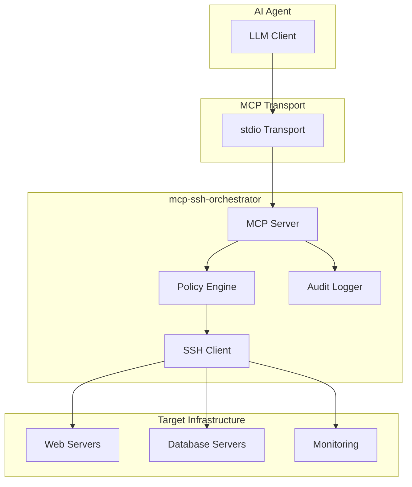

# mcp-ssh-orchestrator

<div align="center">
  
  <h3>A secure SSH fleet orchestrator built as a Model Context Protocol (MCP) server</h3>
  <p>Execute commands across your server fleet with policy-based access control, network filtering, and comprehensive audit logging.</p>
</div>

## 🚀 What is mcp-ssh-orchestrator?

**mcp-ssh-orchestrator** is a secure, policy-driven SSH command executor designed specifically for AI agents. It implements the [Model Context Protocol (MCP)](https://modelcontextprotocol.io) to provide safe, auditable access to your server infrastructure.

### Key Capabilities

- **🔒 Policy-Based Access Control**: Fine-grained command allow/deny rules with glob pattern matching
- **🌐 Network Security**: IP allowlists/blocklists with CIDR support and DNS resolution verification  
- **🔑 Credential Management**: Support for SSH keys and passwords via Docker secrets or environment variables
- **🏷️ Fleet Management**: Tag-based host grouping for bulk operations
- **📊 Real-Time Streaming**: Live command output with progress tracking
- **⏹️ Cancellation Support**: Cancel long-running commands mid-execution
- **📝 Audit Logging**: JSON audit trail to stderr for all operations
- **🐳 Docker-Ready**: Runs in containers with non-root user and health checks

## 🎯 Why This Project Exists

AI agents need safe, controlled access to infrastructure. Traditional approaches like "run arbitrary shell commands" introduce significant security risks:

- **43% of analyzed MCP servers** have command injection flaws
- **Prompt injection** can change agent behavior without code releases
- **Unrestricted access** leads to lateral movement and data exfiltration

This project implements [Docker's MCP security best practices](https://www.docker.com/blog/mcp-security-explained/) to provide:

- **Containerized execution** with resource limits
- **Policy-enforcing gateway** between agents and tools
- **Comprehensive audit trails** for compliance
- **Defense-in-depth security** model

## 🏗️ Architecture Overview



## 🚀 Quick Start

### Using Docker (Recommended)

```bash
# Pull the image
docker pull ghcr.io/samerfarida/mcp-ssh-orchestrator:0.1.0

# Run interactively
docker run -i --rm \
  -v ~/mcp-ssh/config:/app/config:ro \
  -v ~/mcp-ssh/keys:/app/keys:ro \
  ghcr.io/samerfarida/mcp-ssh-orchestrator:0.1.0
```

### Basic Configuration

1. **Create configuration directory:**
   ```bash
   mkdir -p ~/mcp-ssh/{config,keys,secrets}
   ```

2. **Copy example configurations:**
   ```bash
   cp examples/example-servers.yml ~/mcp-ssh/config/servers.yml
   cp examples/example-credentials.yml ~/mcp-ssh/config/credentials.yml
   cp examples/example-policy.yml ~/mcp-ssh/config/policy.yml
   ```

3. **Add your SSH keys:**
   ```bash
   cp ~/.ssh/id_ed25519 ~/mcp-ssh/keys/
   chmod 0400 ~/mcp-ssh/keys/id_ed25519
   ```

## 📚 Documentation Structure

This wiki is organized into 16 comprehensive sections:

### **Core Concepts**
- **[MCP Overview](01-MCP-Overview)** - Understanding the Model Context Protocol
- **[Risks](02-Risks)** - Security challenges in MCP environments
- **[Design Goals](03-Design-Goals)** - Project philosophy and principles
- **[Architecture](04-Architecture)** - System design and component relationships

### **Security & Configuration**
- **[Security Model](05-Security-Model)** - Defense-in-depth security architecture
- **[Configuration](06-Configuration)** - Complete configuration reference
  - [servers.yml](06.1-servers.yml) - Host inventory management
  - [credentials.yml](06.2-credentials.yml) - SSH authentication setup
  - [policy.yml](06.3-policy.yml) - Security policy engine

### **Usage & Operations**
- **[Tools Reference](07-Tools-Reference)** - Complete MCP tools documentation
- **[Usage Cookbook](08-Usage-Cookbook)** - Practical examples and patterns
- **[Deployment](09-Deployment)** - Production setup and scaling
- **[Integrations](10-Integrations)** - Claude Desktop and other MCP clients

### **Operations & Maintenance**
- **[Observability & Audit](11-Observability-Audit)** - Logging, monitoring, compliance
- **[Troubleshooting](12-Troubleshooting)** - Common issues and solutions
- **[Contributing](13-Contributing)** - Development workflow and guidelines

### **Project Information**
- **[Roadmap](14-Roadmap)** - Future features and milestones
- **[FAQ](15-FAQ)** - Frequently asked questions
- **[Glossary](16-Glossary)** - Terms and definitions

## 🔧 MCP Tools Quick Reference

| Tool | Purpose | Example |
|------|---------|---------|
| `ssh_ping` | Health check | `{"name": "ssh_ping"}` |
| `ssh_list_hosts` | List configured hosts | `{"name": "ssh_list_hosts"}` |
| `ssh_describe_host` | Get host details | `{"name": "ssh_describe_host", "arguments": {"alias": "web1"}}` |
| `ssh_plan` | Dry-run command | `{"name": "ssh_plan", "arguments": {"alias": "web1", "command": "uptime"}}` |
| `ssh_run` | Execute command | `{"name": "ssh_run", "arguments": {"alias": "web1", "command": "uptime"}}` |
| `ssh_run_on_tag` | Bulk operations | `{"name": "ssh_run_on_tag", "arguments": {"tag": "prod", "command": "uptime"}}` |
| `ssh_cancel` | Cancel running command | `{"name": "ssh_cancel", "arguments": {"task_id": "web1:a1b2c3d4:1234567890"}}` |
| `ssh_reload_config` | Reload configuration | `{"name": "ssh_reload_config"}` |

[See complete Tools Reference](07-Tools-Reference) for detailed documentation.

## 🔒 Security Features

This project implements comprehensive security controls:

### **Container Security**
- Non-root execution (UID 10001)
- Read-only filesystem mounts
- Resource limits (CPU, memory)
- Minimal base image (python:3.13-slim)

### **Network Security**
- IP allowlists with CIDR support
- Host key verification (known_hosts)
- DNS resolution verification
- Egress controls

### **Policy Enforcement**
- Deny-by-default security model
- Glob pattern command matching
- Per-host and per-tag overrides
- Dangerous command substring blocking

### **Audit & Compliance**
- JSON audit logs to stderr
- Complete operation trail
- SOC 2 / ISO 27001 compatible
- PCI-DSS and HIPAA ready

## 🤝 Contributing

We welcome contributions! See our [Contributing Guide](13-Contributing) for:

- Development setup
- Code style guidelines
- Testing requirements
- Pull request process

## 📄 License

Apache 2.0 - See [LICENSE](https://github.com/samerfarida/mcp-ssh-orchestrator/blob/main/LICENSE) for details.

## 🔗 Links

- **[GitHub Repository](https://github.com/samerfarida/mcp-ssh-orchestrator)**
- **[Issue Tracker](https://github.com/samerfarida/mcp-ssh-orchestrator/issues)**
- **[MCP Specification](https://modelcontextprotocol.io)**
- **[Docker MCP Security Guide](https://www.docker.com/blog/mcp-security-explained/)**

---

**Next Steps:** Start with [MCP Overview](01-MCP-Overview) to understand the protocol, then explore [Architecture](04-Architecture) to see how everything fits together.
