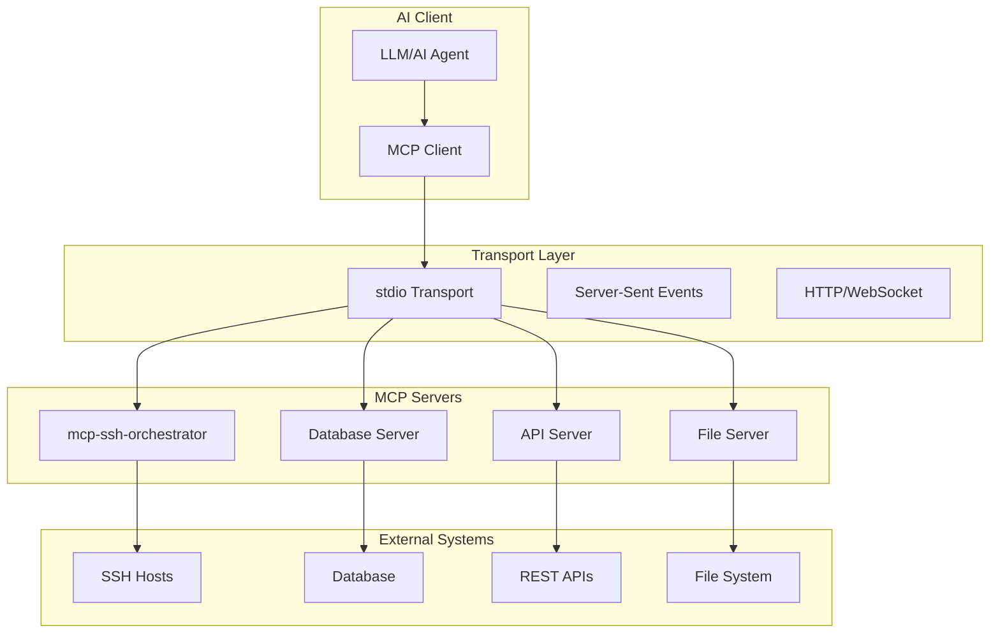

# 1. MCP Overview

**Purpose:** Explain what the Model Context Protocol (MCP) is, why it exists, and how it enables secure AI agent interactions with external tools and services.

## What is the Model Context Protocol (MCP)?

The **Model Context Protocol (MCP)** is a standardized interface that enables AI agents to safely interact with external tools, databases, and services. Released by Anthropic in November 2024, MCP has gained massive adoption and is quickly becoming the connective tissue between AI agents and the tools they act on.

### Core Concept

MCP provides a **standardized communication layer** between AI clients (like Claude Desktop) and external servers (like mcp-ssh-orchestrator). Think of it as an "API schema for AI tools" that ensures:

- **Consistent interfaces** across different tools
- **Type-safe communication** with structured data
- **Security boundaries** between agents and external systems
- **Audit trails** for all interactions

## MCP Architecture



## Why MCP Exists

### The Problem: Uncontrolled AI Tool Access

Before MCP, AI agents typically accessed external systems through:

- **Custom APIs** with inconsistent interfaces
- **Direct shell access** with unlimited privileges  
- **Hardcoded integrations** that were difficult to audit
- **No standardization** across different tools

This led to:
- **Security vulnerabilities** (43% of analyzed servers have command injection flaws)
- **Inconsistent behavior** across different tools
- **Difficult auditing** and compliance
- **Vendor lock-in** with proprietary interfaces

### The Solution: Standardized, Secure Protocol

MCP addresses these issues by providing:

1. **Standardized Interface**: All MCP servers implement the same protocol
2. **Type Safety**: Structured request/response formats
3. **Security Boundaries**: Clear separation between clients and servers
4. **Auditability**: Built-in logging and monitoring capabilities
5. **Composability**: Mix and match different MCP servers

## MCP Transport Types

MCP supports multiple transport mechanisms:

### stdio Transport (Most Common)
```json
{
  "jsonrpc": "2.0",
  "method": "tools/call",
  "params": {
    "name": "ssh_run",
    "arguments": {
      "alias": "web1",
      "command": "uptime"
    }
  },
  "id": 1
}
```

**Use Cases:**
- Local development
- Docker containers
- Process-to-process communication

### Server-Sent Events (SSE)
```javascript
// Client connects to SSE endpoint
const eventSource = new EventSource('/mcp/sse');

// Server streams responses
eventSource.onmessage = function(event) {
  const response = JSON.parse(event.data);
  // Handle MCP response
};
```

**Use Cases:**
- Web applications
- Real-time streaming
- Cross-origin communication

### HTTP/WebSocket
```bash
# HTTP POST request
curl -X POST https://api.example.com/mcp \
  -H "Content-Type: application/json" \
  -d '{"jsonrpc":"2.0","method":"tools/call",...}'
```

**Use Cases:**
- REST APIs
- WebSocket connections
- Cloud deployments

## MCP vs Traditional Approaches

| Aspect | Traditional APIs | MCP |
|--------|------------------|-----|
| **Interface** | Custom, inconsistent | Standardized protocol |
| **Security** | Ad-hoc, varies by tool | Built-in security boundaries |
| **Auditing** | Manual, inconsistent | Structured logging |
| **Composability** | Difficult to combine | Designed for composition |
| **Type Safety** | Often string-based | Structured JSON-RPC |
| **Transport** | Usually HTTP only | Multiple transport options |

## MCP Security Model

MCP introduces a **layered security model** that addresses the unique challenges of AI agent interactions:

### 1. Transport Security
- **Encrypted communication** (TLS for HTTP/WebSocket)
- **Process isolation** (stdio transport)
- **Authentication** at the transport layer

### 2. Protocol Security
- **Structured requests** prevent injection attacks
- **Type validation** ensures data integrity
- **Error handling** prevents information leakage

### 3. Server Security
- **Containerized execution** with resource limits
- **Policy enforcement** at the server level
- **Audit logging** for all operations

### 4. Client Security
- **Tool allowlists** restrict available servers
- **Signature verification** ensures server authenticity
- **Call interceptors** for pre/post processing

## MCP Ecosystem

The MCP ecosystem includes:

### Official Components
- **[MCP Specification](https://modelcontextprotocol.io/specification/2025-06-18/basic/)** - Official protocol definition
- **[MCP SDK](https://github.com/modelcontextprotocol/sdk)** - Reference implementations
- **[MCP Registry](https://github.com/docker/mcp-registry)** - Curated server catalog

### Popular Servers
- **mcp-ssh-orchestrator** - SSH command execution (this project)
- **mcp-server-filesystem** - File system access
- **mcp-server-database** - Database operations
- **mcp-server-git** - Git repository management

### Client Integrations
- **Claude Desktop** - Native MCP support
- **OpenAI Codex** - Via Docker MCP Toolkit
- **Custom Applications** - Using MCP SDK

## How mcp-ssh-orchestrator Fits In

mcp-ssh-orchestrator is designed as a **secure MCP server** that implements Docker's MCP security best practices:

### Security-First Design
- **Containerized execution** with resource limits
- **Policy-based access control** with deny-by-default
- **Network segmentation** with IP allowlists
- **Comprehensive audit logging** for compliance

### MCP Compliance
- **Full MCP specification** implementation
- **stdio transport** for Docker compatibility
- **Structured JSON-RPC** communication
- **Type-safe interfaces** for all tools

### Production Ready
- **Non-root execution** for security
- **Health checks** for monitoring
- **Graceful error handling** for reliability
- **Resource limits** for stability

## Getting Started with MCP

### 1. Understand the Protocol
Read the [MCP Specification](https://modelcontextprotocol.io/specification/2025-06-18/basic/) to understand the protocol details.

### 2. Explore Security Best Practices
Review [Docker's MCP Security Guide](https://www.docker.com/blog/mcp-security-explained/) for security considerations.

### 3. Try mcp-ssh-orchestrator
Follow our [Quick Start Guide](09-Deployment) to set up mcp-ssh-orchestrator with Claude Desktop.

### 4. Build Your Own Server
Use the [MCP SDK](https://github.com/modelcontextprotocol/sdk) to create custom MCP servers.

## Next Steps

- **[Risks](02-Risks)** - Understanding MCP security challenges
- **[Architecture](04-Architecture)** - How mcp-ssh-orchestrator implements MCP
- **[Security Model](05-Security-Model)** - Defense-in-depth security approach
- **[Deployment](09-Deployment)** - Setting up mcp-ssh-orchestrator

## References

- [MCP Specification](https://modelcontextprotocol.io/specification/2025-06-18/basic/)
- [MCP Getting Started Guide](https://modelcontextprotocol.io/docs/getting-started/intro)
- [Docker MCP Security Guide](https://www.docker.com/blog/mcp-security-explained/)
- [MCP SDK Documentation](https://github.com/modelcontextprotocol/sdk)
- [Docker MCP Registry](https://github.com/docker/mcp-registry)
